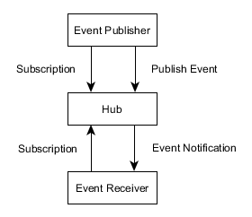

# FHIRcast actors

<small>*FHIR&reg; is the registered trademark of HL7 and is used with the permission of HL7.*</small>

>Actors are information systems or components of information systems that produce, manage, or act on information associated with operational activities in the enterprise.  
*Out of the [IHE Technical Framework](https://www.ihe.net/uploadedFiles/Documents/ITI/IHE_ITI_TF_Vol1.pdf)*

## Actor Overview 
The figure shows the actors involved in the FHIRcast protocol and the relevant transactions between them. 

## Actor Definition
This section gives an overview of the involved actors. An actor definition describes a logical portion of the whole workflow and one system can implement more than one actor, e.g. a system that publishes events can also be interested in the receiving of events from other systems or acts also as a Hub to notify other systems. 

### Hub
The **Hub** actor provides services that manages the shared context between the other actors **Event Publisher** and **Event Receiver**.    

### Event Publisher
The **Event Publisher** actor is able to report distinct events occured in its realm for a distinct topic to the **Hub actor**. 

### Event Receiver
The **Event Receiver** actor receives event notifications from the **Hub** actor for whom he has previously registered.

## Actor Transactions
The following table shows the actor and the transaction definitions. 

Actor          |Transaction       |Opt. |Section
---------------|------------------|:---:|---
Hub            |Subscribe         |R    |
Hub            |Unsubscribe       |R    |
Hub            |Publish Event     |R    |
Hub            |Event Notification|R    |
Event Publisher|Subscribe         |R    |
Event Publisher|Unsubscribe       |O    |
Event Publisher|Publish Event     |R    |
Event Receiver |Subscribe         |R    |
Event Receiver |Unsubscribe       |O    |
Event Receiver |Event Notification|R    |

