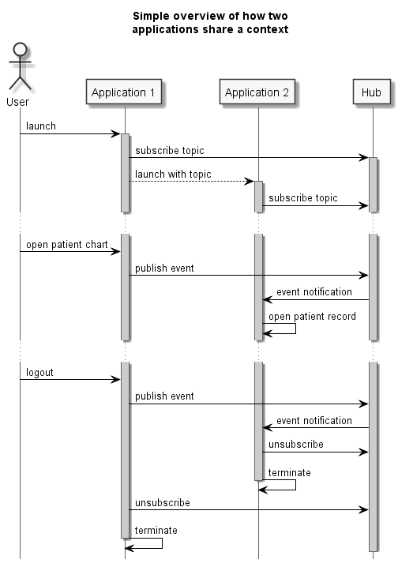

# FHIRcast Transactions

<small>*FHIR&reg; is the registered trademark of HL7 and is used with the permission of HL7.*</small>

This document describes the transactions used in FHIRcast, not in terms of a database transaction where an actor has to rollback data in case of an exception. 

>Transactions are interactions between actors that transfer the required information through messages.\
*Out of the [IHE Technical Framework](https://www.ihe.net/uploadedFiles/Documents/ITI/IHE_ITI_TF_Vol1.pdf)*

## Overview
1. [Subscribe](#subscribe)
2. [Unsubscribe](#unsubscribe)
2. [Publish Event](#publish)
2. [Event Notification](#notification)

*Note:
The launch of an application and sharing the topic is out of scope of this protocol. FHIRcast recommends the <a href="http://www.hl7.org/fhir/smart-app-launch">SMART App Lauch Framework</a>.*

## Subscribe

### Scope
A Client actor using this transaction may locate and join a context  session *specific to the workstation ?* known as "topic" at the Hub actor on which the current user is interacting. The client actor sends in the subscription request the events of interest which may be notified by other Client actors to the Hub within the session.

### Actor Roles

**Actor:** Client  
**Role:** Initiates the subscription intention to the Hub for a list of events reported by other Client actors within a specific context. 
**Actor:** Hub  
**Role:** Responses to the subscription request of a client and verifies the authentity of the Client.

*TODO: describe the transaction*
* Interaction Diagram
* Trigger Events
* Excpected Actions
* Security Considerations

## Unsubscribe

### Scope
A Client actor using this transaction informs the Hub actor that teh interrest of the context session is no longer needed and therefor no more notifications should be reported to him.

### Actor Roles

**Actor:** Client  
**Role:** Initiates the desubscription intention to the Hub for all events reported by other Client actors within the previously subscribed context. 
**Actor:** Hub  
**Role:** Responses to the desubscription request of a client and removes the list of notification receivers.

*TODO: describe the transaction*
* Interaction Diagram
* Trigger Events
* Excpected Actions
* Security Considerations

## Publish Event

*TODO: describe the transaction*
* Scope
* Actor Roles
* Interaction Diagram
* Trigger Events
* Excpected Actions
* Security Considerations

## Event Notification

*TODO: describe the transaction*
* Scope
* Actor Roles
* Interaction Diagram
* Trigger Events
* Excpected Actions
* Security Considerations
